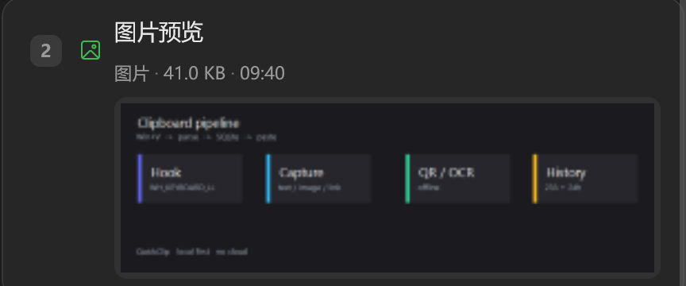
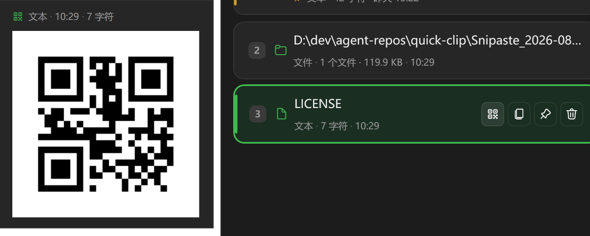
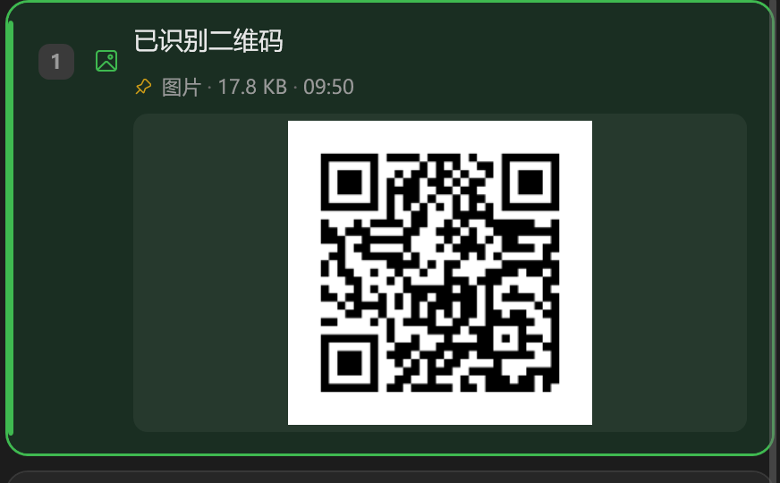

# QuickClip

`Win + V` 唤起的本地剪贴板。图片进列表就能看，文本能生成二维码，截到的码会自动解析。纯离线，不改系统剪贴板。

[](LICENSE)
[](https://dotnet.microsoft.com/download/dotnet/8.0)
[](docs/COMPATIBILITY.md)

<p align="center">
  
</p>

---

## 图片预览

截图、表情包复制进来就是卡片，列表里直接看缩略图。

<p align="center">
  
</p>

## 二维码双向

文本 / 链接悬停即可生成，点一下放大给手机扫。复制一张码，自动抽出链接。

<p align="center">
  
  &nbsp;
  
</p>

## 还有这些

- ⚡ **`Win + V` 静默接管**：钩子吞掉 Win 键，不误弹开始菜单；其它热键优先 `RegisterHotKey`
- 🔍 **拼音首字母**：`设计架构` 搜 `sjjg`
- 🔤 **OCR**：默认 Windows 原生离线；可下载 PP-OCRv6 模型包，或配 OpenAI 兼容视觉接口
- 📌 **窗口置顶**：`Ctrl+P` / 图钉，失焦不藏
- 🧹 **条数上限**：默认最多 233 条，超限淘汰最旧非置顶；超大文本/图片不入库，文件只记路径
- 🎨 **多主题**：Terminal / One Dark / GitHub / Nord …

---

## 下载

从 [Releases](https://github.com/soldier-cv/quick-clip/releases) 下载：

| 包 | 说明 |
| --- | --- |
| `QuickClip-Setup-win-x64.exe` | 安装版（体积小，需已安装 [.NET 8 桌面运行时 x64](https://aka.ms/dotnet/8.0/windowsdesktop-runtime-win-x64.exe)） |

启动后会延迟检查更新并下载到 `%LOCALAPPDATA%\QuickClip\updates\`，可在设置中关闭自动检查。下载完成后点击「立即更新」即可启动安装程序升级。

## 从源码构建

环境：Windows 10 1809+ / Windows 11、[.NET 8 SDK](https://dotnet.microsoft.com/download/dotnet/8.0)。

```powershell
# 本地运行与调试
dotnet run --project src/QuickClip/QuickClip.csproj

# 构建安装包载荷（配合 Inno Setup 编译 setup/QuickClip.iss 生成安装包）
dotnet publish src/QuickClip/QuickClip.csproj -c Release -r win-x64 --self-contained false `
  -p:PublishSingleFile=false -o publish/fdd
```

`publish/` 已加入 `.gitignore`。

## 默认快捷键

除 `Win + V` 与 `1~9` 外，可在设置中改。

| 按键 | 功能 |
| --- | --- |
| `Win + V` | 唤起 / 隐藏主面板 |
| `Ctrl + Shift + V` | 任意程序中纯文本粘贴 |
| `1 ~ 9` | 快速粘贴对应序号 |
| `↑` / `↓` | 移动选中 |
| `Enter` | 粘贴当前项 |
| `Shift + Enter` | 纯文本粘贴当前项 |
| `Ctrl + C` | 复制当前项 |
| `Ctrl + P` | 窗口置顶 |
| `Delete` | 删除当前项 |
| `Esc` | 隐藏面板 |

## 数据与配置

`%LOCALAPPDATA%\QuickClip\`：`quickclip.db`、`previews\`、`updates\`、`settings.json`、`debug.log`。

设置在面板 ⚙ 或托盘里。关闭窗口只是藏到托盘；退出请用托盘右键。

## 文档

- [架构设计](docs/DESIGN.md) · [兼容性](docs/COMPATIBILITY.md) · [安全与隐私](docs/SECURITY.md)
- [文档索引](docs/README.md) · [贡献指南](CONTRIBUTING.md) · [变更记录](CHANGELOG.md)

## 技术栈

C# / .NET 8 + WPF（WPF-UI）· Win32 钩子与剪贴板 · ZXing + QRCoder · Windows.Media.Ocr / RapidOcrNet · SQLite · PinYinConverterCore

## 许可证

**[MIT](LICENSE)**。使用、修改、商用、闭源衍生都可以，副本里保留版权与许可声明即可。无担保。
