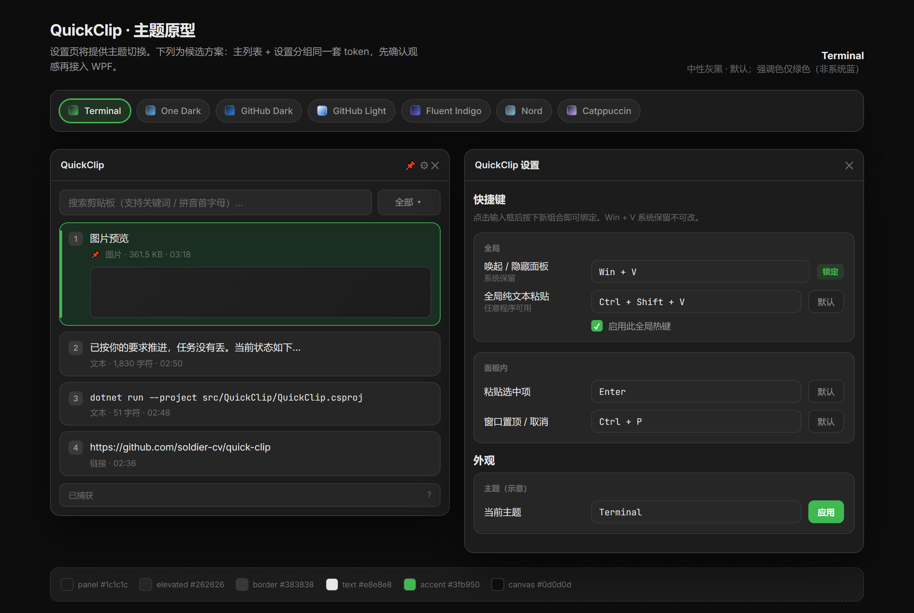

# QuickClip

<p align="center">
  <strong>极速、纯粹、高颜值的 Windows 本地剪贴板管理器</strong>
</p>

<p align="center">
  <a href="LICENSE"></a>
  <a href="https://dotnet.microsoft.com/download/dotnet/8.0"></a>
  <a href="docs/SPECIFICATION.md#五-系统兼容性渲染降级与运行环境"></a>
  <a href="https://github.com/soldier-cv/quick-clip/stargazers"></a>
  <a href="https://github.com/soldier-cv/quick-clip/releases/latest"></a>
  <a href="https://gitee.com/huaxudong/quick-clip"></a>
</p>

<p align="center">
  
</p>

---

## ✨ 核心特性

- 🚀 **极速响应，接管体验**  
  原生 Win32 热键毫秒级唤起；无缝接管系统 `Win + V`；开机自启静默预热视觉树，杜绝冷启动卡顿；退出或卸载时 100% 自动还原系统剪贴板原始状态。

- 📋 **全能记录，格式无损**  
  混合记录纯文本、超链接、图片与多选文件；捕获并写回 `CF_HTML` 与 `RTF` 原文，网页和 Word 排版不丢失；支持汉字模糊匹配与**拼音首字母**（如输入 `sjjg` 秒搜「设计架构」）；重要条目支持图钉置顶。

- 🔄 **收集栈（顺次出栈粘贴）**  
  跨表格、跨网页批量搬运多字段的效率神器。按复制顺序压入先进先出队列，在目标窗口按 `Ctrl + V` 依次粘贴出栈；提供迷你桌面磁吸 HUD，支持多行文本一键拆分为独立条目，出栈完毕自动启用防重复粘贴守卫。

- 📝 **常用短语 & 动态模版**  
  按分类整理常用回复、代码片段与办公模版；内置动态占位符引擎（`{date}`、`{time}`、`{guid}`、`{username}`、`{clipboard}` 等）；支持即用即走的「微调填入」，临时改几个字直接注入，不破坏原始模版。

- 📌 **桌面贴图置顶**  
  将图片或截图一键钉在屏幕最前端；支持鼠标滚轮平滑缩放（20%~400%）与 `Ctrl + 滚轮` 调节透明度；按 `Esc` 或双击瞬时关闭，方便对照核对。

- 🛠️ **实用集成工具**  
  - **二维码**：悬停文本卡片一键生成高清二维码传给手机；复制含码图片后台自动解析，支持双击色块直接粘贴。
  - **OCR 识别**：支持 Windows 系统本地离线 OCR 与 AI 视觉大模型双模，识别结果可在弹窗内就地校对纠错后复制。
  - **卡片翻译**：抽屉式平滑展开译文，支持中英双向互译与一键替换粘贴。

- 🔒 **纯本地存储，极致隐私**  
  数据 100% 存储在本机 SQLite 数据库中，不设云端服务器，绝不上传任何隐私；托盘菜单支持一键「暂停捕获」，保护敏感操作。

---

## 📸 视觉体验一览

<p align="center">
  
</p>

<p align="center">
  
</p>

<p align="center">
  
  &nbsp;&nbsp;
  
</p>

---

## ⌨️ 常用快捷键

> 除 `Win + V` 与数字直贴外，大部分快捷键均可在设置中自定义。

| 按键 | 作用范围 | 说明 |
| :--- | :--- | :--- |
| `Win + V` | 全局 | 打开 / 隐藏 QuickClip 主面板 |
| `Enter` | 主面板 | 粘贴选中条目（保留富文本样式与文件对象） |
| `Shift + Enter` | 主面板 | 纯文本粘贴（剥离网页/Word 格式或提取文件纯路径） |
| `1` ~ `9` | 主面板 | 极速直贴列表第 1～9 项 |
| `↑` / `↓` | 主面板 | 顺次上下移动选中项 |
| `Ctrl + C` | 主面板 | 仅将选中项复制回系统剪贴板，不触发自动粘贴 |
| `Delete` | 主面板 | 删除选中条目（同步清理缩略图） |
| `Ctrl + P` | 主面板 | 切换窗口置顶（保持面板常驻，适合连续填表） |
| `Ctrl + Shift + V` | 全局 | 纯文本贴出当前剪贴板最新内容 |
| `Ctrl + Shift + S` | 全局 | 开启 / 关闭收集栈（顺次粘贴会话） |
| `Ctrl + V` | 收集栈激活时 | 按出栈顺序顺次贴出下一条 |
| `Esc` | 任意窗口 | 隐藏面板 / 退出收集栈 / 关闭贴图或弹窗 |

---

## 📥 下载与极速上手

### 1. 环境准备
QuickClip 基于 .NET 8 开发，请先确保已安装 [.NET 8 桌面运行时 (x64)](https://aka.ms/dotnet/8.0/windowsdesktop-runtime-win-x64.exe)（已安装可直接跳过）。

### 2. 下载安装
下载最新版安装程序 `QuickClip-Setup-win-x64.exe`：
- [Gitee Releases](https://gitee.com/huaxudong/quick-clip/releases)（国内高速直连）
- [GitHub Releases](https://github.com/soldier-cv/quick-clip/releases)

### 3. 三步极速上手
1. **日常复制**：在任意软件中正常复制（`Ctrl + C`），QuickClip 后台自动记录入库。
2. **呼出面板**：在需要输入的地方按下 `Win + V`。
3. **选定粘贴**：键盘上下键选定后按 `Enter`（或鼠标双击、或按 `1`~`9`），内容即刻精准注入。

---

## ❓ 常见问题 (FAQ)

<details>
<summary><strong>按 Win + V 无法呼出或弹出了 Windows 自带剪贴板？</strong></summary>

1. 检查桌面右下角系统托盘是否已有 QuickClip 图标；若未运行，从开始菜单启动。  
2. 若弹出的是系统自带剪贴板，请打开 QuickClip「设置 → 常规」，勾选「接管系统剪贴板」。  
3. 若目标窗口为管理员权限（高完整性级别），请将 QuickClip 也以管理员权限运行，以避免系统跨权限拦截快捷键。
</details>

<details>
<summary><strong>手机复制的内容，电脑上可以自动看到吗？</strong></summary>

QuickClip 坚守“纯本地，不上传云端”的隐私原则，不自建云同步服务器。  
若您使用微信输入法、跨屏互联等工具，当手机内容流转到电脑系统剪贴板时，QuickClip 会在毫秒级自动捕获并存入本地历史。
</details>

<details>
<summary><strong>剪贴板数据保存在哪里？如何彻底卸载？</strong></summary>

- **数据存放**：所有配置、数据库与图片缓存均保存在 `%LOCALAPPDATA%\QuickClip\` 目录中，不污染其他路径。  
- **安全卸载**：通过系统「应用和功能」正常卸载，卸载程序会自动按备份还原 Windows 系统自带剪贴板与注册表设置。
</details>

<details>
<summary><strong>如何检查与获取版本更新？</strong></summary>

在 QuickClip 托盘图标右键菜单中点击「检查更新…」，或在「设置 → 关于」中检查。发现新版本将通过国内高速镜像自动下载并无感升级。
</details>

---

## 🛠️ 从源码构建

开发运行环境需安装 [.NET 8 SDK](https://dotnet.microsoft.com/download/dotnet/8.0) 及 Windows 10 (1809+) / Windows 11。

```powershell
# 本地运行与调试
dotnet run --project src/QuickClip/QuickClip.csproj

# 本地发布 Release 独立包
dotnet publish src/QuickClip/QuickClip.csproj -c Release -r win-x64 --self-contained false `
  -p:PublishSingleFile=false -o publish/fdd
```

安装包使用 Inno Setup 编译 `setup/QuickClip.iss`。

---

## 📚 文档导航

| 文档 | 内容 |
| :-- | :-- |
| [docs/SPECIFICATION.md](docs/SPECIFICATION.md) | 产品定位、功能全景矩阵、核心架构与系统兼容性基线 |
| [AGENT.md](AGENT.md) | 开发准则、C# 编码规范与常用命令速查 |
| [CHANGELOG.md](CHANGELOG.md) | 逐版本更新记录与修复明细 |
| [docs/preview.html](docs/preview.html) | 界面结构与配色预览页 |

---

## 🤝 参与贡献

欢迎提交缺陷修复与改进建议：

- **反馈问题**：通过 [Issue 模板](.github/ISSUE_TEMPLATE) 提交缺陷报告或功能建议，请尽量附上复现步骤与系统版本。
- **提交代码**：Fork 本仓库后开分支开发，按 [PR 模板](.github/pull_request_template.md) 提交 Pull Request，并确保本地 `dotnet build QuickClip.sln -c Debug` 零错误零警告。

---

## 🙏 致谢与开源协议

感谢 [@wlight](https://github.com/wlight) 以及所有提出反馈、贡献 Star 的朋友。  
在功能探索上，从 OneClip 了解并启发了收集栈（批量顺次粘贴）的使用需求；界面采用 [WPF-UI](https://github.com/lepoco/wpfui) 现代化控件库构建。

本项目基于 [MIT 许可证](LICENSE) 开源发布。
