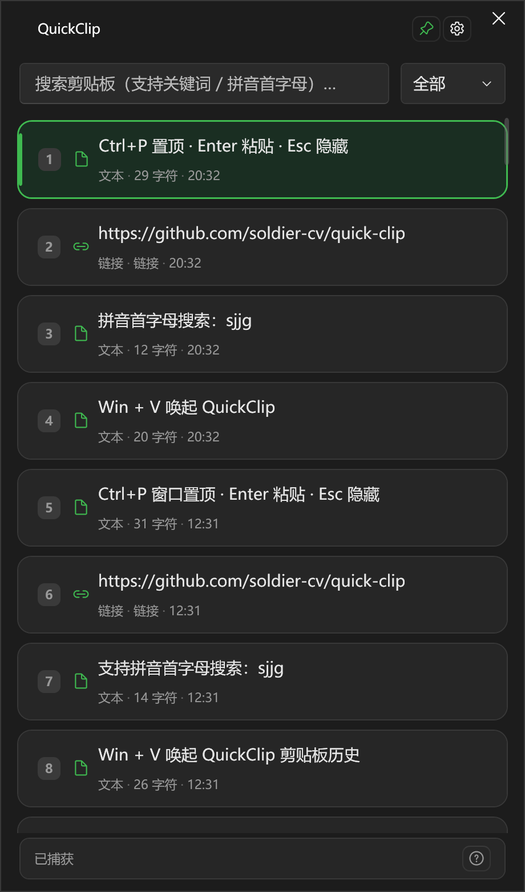

# QuickClip 极速剪贴板

> 专为 **Windows 10 / 11** 打造的现代化、极速、纯离线剪贴板增强工具，接管系统原生 `Win + V`，本地存储剪贴板历史。

[](LICENSE)
[](https://dotnet.microsoft.com/download/dotnet/8.0)
[](docs/COMPATIBILITY.md)



---

## 核心特性

- ⚡ **毫秒级响应**：`Win + V` 由低级键盘钩子静默接管（并防止误弹开始菜单），全局纯文本粘贴等热键优先走 `RegisterHotKey`，注册失败自动回退钩子。
- 🎨 **Fluent 卡片流**：文本/图片/链接/文件统一卡片化，截图大图一目了然，点击秒级粘贴。
- 🔍 **智能搜索**：关键词模糊匹配 + 中文拼音首字母（如「设计架构」→ `sjjg`）。
- 📱 **二维码双向离线互转**：文本一键生成二维码；二维码截图复制后自动识别并提取链接。
- 🔍 **Windows 原生离线 OCR**：调用系统内置 `Windows.Media.Ocr` 引擎；亦可配置 Ollama / OpenAI。
- 📌 **窗口前端置顶**：`Ctrl+P` / 图钉固定面板；失焦不藏、粘贴后保持打开。
- 🧹 **条数 + 24 小时双限**：默认最多 233 条，超龄或超条数淘汰非置顶；列表可一键清空。
- 📦 **大体积极限**：超大文本/图片不记历史；文件只记路径。不改写系统剪贴板，复制后仍可粘到别处。
- 🎨 **多主题**：Terminal / One Dark / GitHub / Nord 等；悬停预览与主题一致。
- 🧩 **纯离线**：日常功能本地完成；仅「检查更新」在用户主动点击时联网。

---

## 系统要求

| 支持 | 不支持 |
| --- | --- |
| Windows 10 **1809+**、Windows 11（**x64**） | **Windows 7 / 8**、非 Windows、32 位系统 |

详见 [docs/COMPATIBILITY.md](docs/COMPATIBILITY.md)。

---

## 下载

从 [Releases](https://github.com/soldier-cv/quick-clip/releases) 下载最新版 `QuickClip.exe`（单文件自包含，免安装 .NET 运行时），双击即用。

## 从源码构建

环境要求：Windows 10 1809+ / Windows 11、[.NET 8 SDK](https://dotnet.microsoft.com/download/dotnet/8.0)。

```powershell
# 调试运行
dotnet run --project src/QuickClip/QuickClip.csproj

# 发布单文件绿色版（自包含）
dotnet publish src/QuickClip/QuickClip.csproj -c Release -r win-x64 --self-contained true -p:PublishSingleFile=true -o publish
```

`publish/` 为本地输出目录，已加入 `.gitignore`，不会进版本库。

## 默认键盘快捷键

（均可在设置中查看；除 `Win + V` 与 `1~9` 外可自定义）

| 按键 | 功能 |
| --- | --- |
| `Win + V` | 唤起 / 隐藏主面板（系统保留，不可改） |
| `Ctrl + Shift + V` | 任意程序中以纯文本粘贴 |
| `1 ~ 9` | 快速粘贴对应序号项（固定） |
| `↑ / ↓` | 列表上下移动选中 |
| `Enter` | 粘贴当前选中项 |
| `Shift + Enter` | 以纯文本粘贴当前选中项 |
| `Ctrl + C` | 复制当前项到系统剪贴板 |
| `Ctrl + P` | 窗口置顶 / 取消置顶 |
| `Delete` | 删除当前项 |
| `Esc` | 隐藏面板 |

---

## 数据与配置

- 数据目录：`%LOCALAPPDATA%\QuickClip\`
  - `quickclip.db`：剪贴板历史
  - `previews\`：图片缩略图
  - `settings.json`：热键、自启动等
  - `debug.log`：诊断日志
- 设置：面板 ⚙ 或托盘 → 设置…
- 退出：托盘右键 → 退出；关闭窗口仅隐藏到托盘

---

## 文档与资源

- 📘 [架构设计](docs/DESIGN.md)
- 🖥️ [兼容性说明](docs/COMPATIBILITY.md)
- 🔒 [安全与隐私](docs/SECURITY.md)
- 📂 [文档索引](docs/README.md)
- 🤝 [贡献指南](CONTRIBUTING.md)
- 📝 [变更记录](CHANGELOG.md)

## 技术栈

- C# / .NET 8 + WPF（WPF-UI）
- Win32：`WH_KEYBOARD_LL`、`AddClipboardFormatListener`、`SendInput`
- 二维码：ZXing.Net + QRCoder
- OCR：Windows.Media.Ocr（可选 Ollama / OpenAI）
- 存储：Microsoft.Data.Sqlite
- 搜索：PinYinConverterCore

---

## 许可证

**[MIT](LICENSE)** — 宽松开源协议。

你可以自由地：

- 使用、复制、修改、合并
- 发布、再分发、再授权
- **商用、闭源衍生、随便造**

唯一要求：在副本中保留版权与 MIT 许可声明。无担保（AS IS）。

欢迎 fork、PR 与二次创作。
