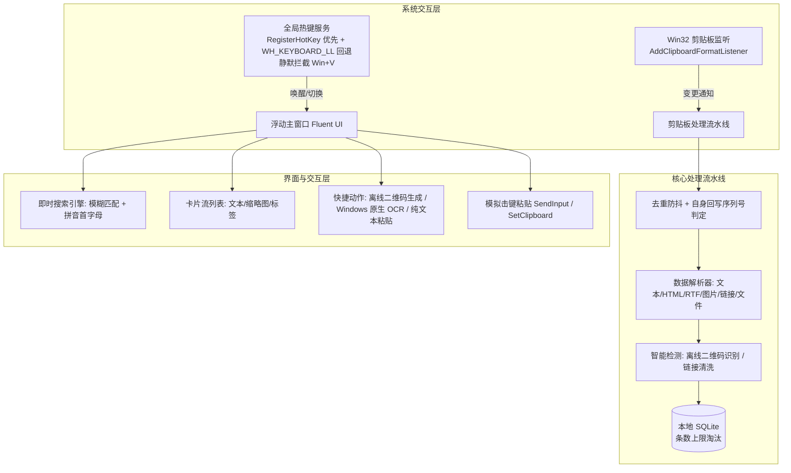

# QuickClip 详细架构与功能设计规范

本文档为 QuickClip Windows 剪贴板工具的详细技术规范与实现设计。

---

## 1. 核心架构设计



---

## 2. 模块技术实现细节

### 2.1 全局热键拦截（替换系统 Win+V）
`HotkeyService` 采用“`RegisterHotKey` 优先、低级钩子回退”的双层策略：

- **全局纯文本粘贴（固定 `Ctrl+Shift+V`，可启用/禁用）**：优先调用 `RegisterHotKey` + 隐藏消息窗口（`HwndSource`），由系统可靠投递 `WM_HOTKEY`；组合被其他程序占用导致注册失败时，自动回退到低级钩子检测。
- **`Win + V`（固定，不可修改）**：系统开启剪贴板历史时该组合已被 Shell 注册（`RegisterHotKey` 返回 1409），因此统一由 `WH_KEYBOARD_LL` 钩子接管，采用「Win 键状态机」：
  - **吞掉 Win 键按下**（返回 1），开始菜单根本不会弹出，从根源消除“全屏闪一下”；
  - V 键进入和弦判定：按下/弹起均拦截（返回 1），系统原生剪贴板历史不会弹出，并触发面板切换；
  - **重放保留系统快捷键**：若 Win 之后按下的是其它键（Win+E 等），钩子重放注入「Win + 该键」完整和弦（`SendInput`），系统仍可识别原始快捷键；弹起时再注入 Win 弹起保持键状态平衡；
  - **单独按 Win**：仅在弹起时重放一次 Win 按下/弹起，恢复系统“打开开始菜单”行为。
- 钩子运行在独立后台线程（`GetMessage` 消息泵），回调通过 `Dispatcher.BeginInvoke` 切回 UI 线程；自身 `SendInput` 注入的按键带 `LLKHF_INJECTED` 标志，钩子据此跳过，防止与合成 `Ctrl+V` 互相回环。
- **按键自动重复过滤**：按住 `Win+V` 或纯文本组合时系统会产生连续重复的 `WM_KEYDOWN`，钩子用按下标记（`_winVKeyDown` / `_plainPasteKeyDown`）只响应首次按下，弹起时复位，避免长按导致面板反复切换或连续粘贴。
- **前台置前兜底（解决“呼不出”）**：热键唤起时 Windows 前台锁可能拒绝 `SetForegroundWindow`（面板显示在其他窗口后面或未获得焦点）。`ShowWindow` 采用「临时 `HWND_TOPMOST` 置顶 → `SetForegroundWindow` → 恢复 `HWND_NOTOPMOST`」序列，强制把面板带到最前并激活，规避前台锁限制。
- **管理员窗口兜底（UIPI）**：`WH_KEYBOARD_LL` 钩子无法收到「以管理员权限运行」窗口的键盘输入（Windows UIPI 权限隔离），此时 `Win+V` 会漏给系统弹出原生剪贴板历史。`SystemClipboardGuard` 以 120ms 低频轮询前台窗口，命中「系统剪贴板历史」（类名 `Windows.UI.Core.CoreWindow` + 标题含「剪贴板历史 / Clipboard history」+ 非本进程）后注入 ESC 关闭它，再唤起 QuickClip 面板。每个窗口句柄只处理一次，句柄消失后才解除标记（避免 ESC 未生效时反复注入、反复切换面板）。钩子正常接管时该窗口不会出现，守卫零干扰。
- **系统级接管（注册表）**：`SystemClipboardService` 在接管前把 `HKCU\Software\Microsoft\Clipboard\EnableClipboardHistory` 与 `HKCU\...\Explorer\Advanced\DisabledHotkeys` 的原始状态写入 `system-clipboard-snapshot.json`，再把历史开关置 0、把 `V` 追加进 `DisabledHotkeys`。退出、用户关闭接管、以及卸载（`QuickClip.exe --restore-clipboard`）都按快照精确还原（含「值原本不存在」时删除该值）。设置页「系统剪贴板接管」行可随时开关。

### 2.2 剪贴板监听与防抖
- 使用 `AddClipboardFormatListener(IntPtr hWnd)`；窗口句柄在启动时通过 `WindowInteropHelper.EnsureHandle()` 提前创建，因此**开机自启动（不显示面板）也能挂上监听**。
- 窗口消息循环处理 `WM_CLIPBOARDUPDATE (0x031D)`。
- **自身回写用剪贴板序列号识别**：`PasteService` 写入成功后记录 `GetClipboardSequenceNumber()`，捕获快照带的序列号与之相等即判定为自身回写并跳过。不再使用 2.5 秒盲窗抑制，因此用户在粘贴后立刻复制的新内容不会被丢掉。
- 读取前后各取一次序列号，若期间剪贴板又变了，本次快照直接丢弃（那次变更会再触发一次通知）。
- 连续剪贴板事件用信号量串行化；同一内容 8 秒内不重复入库。
- 用户可在托盘菜单勾选「暂停捕获」临时停止记录（面板底部有状态徽章）。

### 2.3 纯离线智能互转引擎
1. **二维码离线解析**：
   - 使用 `ZXing.Net` 库；
   - 捕获图片走原生 DIB 读取（`CF_DIBV5` 优先，回退 `CF_DIB`）；DIB 常带全 0 Alpha，须按不透明写盘，否则缩略图透明且 ZXing 解不出；
   - 捕获到图片后，在后台线程中将其送入 `BarcodeReader.Decode(bitmap)`；
   - 若解析成功，提取 URL/字符串，写入 `qr_content`（卡片 `HasQr` / `QrText`）。
   - 列表只标「已识别二维码」并保留原图，不把解码正文叠在卡片上；悬停预览展示 `QrText`。
   - 列表同一按钮：文本/链接为「转二维码」；已识别二维码图图标改为解析，悬停仍预览原图 + 解码正文，点击把 `QrText` 写成纯文本（自身回写由序列号识别，不会新增条目）。
2. **二维码离线生成**：
   - 使用 `QRCoder` 库；
   - 对任意选中的文本或 URL，在内存中直接调用 `QRCodeGenerator.CreateQrCode(...)` 渲染高清位图，无需网络请求。
3. **Windows 原生离线 OCR**：
   - 引用 WinRT 原生库 `Windows.Media.Ocr.OcrEngine`；
   - 将剪贴板位图转换为 `SoftwareBitmap`，直接本地调用 `engine.RecognizeAsync(softwareBitmap)` 毫秒级提取文本。
4. **可选 PP-OCRv6 离线包**（不打进安装包）：
   - 设置页下载 Small / Medium，或指定自备 `det` + `rec` + 字典目录；
   - 模型落在 `%LOCALAPPDATA%\QuickClip\ocr\`；失败回退系统 OCR。
   - 下载进度与失败原因保留在设置页；HTTP 状态、文件大小、SHA256 校验写入 `debug.log`。
5. **OpenAI 兼容视觉接口**：
   - 一组地址 + 模型 + 可选 API Key；默认按 chat/completions。URL 若仍是旧版 `/api/generate` 则走 Ollama 原生。

### 2.4 存储结构与条数淘汰
- 本地数据库：`quickclip.db`（SQLite）
- 数据表定义：
  ```sql
  CREATE TABLE IF NOT EXISTS clipboard_items (
      id INTEGER PRIMARY KEY AUTOINCREMENT,
      content_type TEXT NOT NULL,          -- 'text', 'image', 'link', 'file'
      text_content TEXT,                   -- 纯文本内容 / 链接 / 文件路径
      html_content TEXT,                   -- CF_HTML 原文（保留格式粘贴用）
      rtf_content TEXT,                    -- CF_RTF 原文
      preview_path TEXT,                   -- 缩略图路径 (图片类型)
      qr_content TEXT,                     -- 解析出的二维码内容
      char_count INTEGER,                  -- 字符计数或文件大小
      is_pinned INTEGER DEFAULT 0,         -- 0: 正常, 1: 收藏置顶
      created_at DATETIME DEFAULT CURRENT_TIMESTAMP
  );

  CREATE INDEX IF NOT EXISTS idx_created_at ON clipboard_items(created_at);
  ```
- 旧库启动时自动 `ALTER TABLE` 补 `html_content` / `rtf_content` 两列。
- **自动淘汰**（置顶豁免）：总数超过 `MaxHistoryItems`（默认 233，可配置 50～2000）时删最旧非置顶。写入时立即裁条数；定时任务（启动约 8 分钟后，之后每 60 分钟）再裁一次并清理孤儿预览。不按时间过期。调小上限时会先弹确认框。
- **损坏自愈**：数据库文件损坏（`SQLITE_NOTADB` / `SQLITE_CORRUPT`）时改名备份为 `quickclip.db.corrupt-<时间戳>` 并重建空库，避免整个应用启动失败。
- **捕获体积（只影响是否记历史，绝不改写系统剪贴板）**：
  - 文本/链接 &gt; 2M 字符 → 不入库  
  - 图片像素 &gt; 40MP 或落盘 PNG &gt; 30MB → 不入库（删临时预览）  
  - HTML / RTF 原文各 &gt; 1MB → 只保留纯文本  
  - 文件：只记路径，不拷贝本体、不进 BLOB；路径列表文本过长则不入库  
  - 超限时用户仍可把内容粘贴到其他程序

---

## 3. UI 界面布局与键盘交互流

### 3.1 界面线框图
```
+-------------------------------------------------------------------------+
|  🔍 搜索剪贴板 (支持拼音首字母/关键词)...           [全部 | 文本 | 图片 | 链接] |
+-------------------------------------------------------------------------+
| [1] 🔗 https://github.com/microsoft/winui3                    [📱转二维码] |
|     Microsoft WinUI 3 官方仓库地址                                 12:40 |
+-------------------------------------------------------------------------+
| [2] 🖼️ 已识别二维码                                          [🔍解析成文] |
|     [缩略图] 图片 · 17.8 KB                                    11:15 |
+-------------------------------------------------------------------------+
| [3] 🖼️ 软件开发架构图设计稿                                  [🔍提取文字OCR] |
|     [缩略图] 系统架构示意图 (1920x1080)                            09:30 |
+-------------------------------------------------------------------------+
| [4] 📝 public static void SetWindowsHookEx(...)                [💻代码块] |
|     Win32 API 键盘钩子定义                                         昨天   |
+-------------------------------------------------------------------------+
| 💡 状态信息 + [?] 快捷键说明（悬停展示）                                        |
+-------------------------------------------------------------------------+
```

### 3.2 键盘快捷键体系
- `Win + V`：唤起 / 隐藏主面板（全局拦截，替换系统原生剪贴板历史）。
- `Ctrl + Shift + V`：任意程序中以纯文本粘贴（全局可用，去掉原格式）。
- `1 ~ 9`：快速将对应序号项填充并粘贴至目标窗口。
- `↑ / ↓`：在列表中导航移动光标。
- `Enter`：粘贴当前选中项（条目存有 CF_HTML / CF_RTF 时一并写回，保留格式）。
- `Shift + Enter`：以纯文本粘贴当前选中项（去掉原格式）。
- `Ctrl + C`：复制当前项到系统剪贴板（保留格式；列表顺序不变）。
- `Ctrl + P`：窗口置顶 / 取消置顶（前端固定，失焦不隐藏）。
- `Delete`：从历史中删除当前项（焦点在搜索框时不触发）。
- `Esc`：关闭并隐藏窗口。

> 焦点在搜索框时，`Enter` / `Shift+Enter` / `↑` / `↓` 仍然可用（搜索 → 选择 → 粘贴），
> 但 `Delete` / `Ctrl+P` / `Ctrl+C` / `1~9` 被屏蔽，避免边打字边误删条目。


---

## 4. 实际实现说明（v1.0）

### 4.1 全局热键服务线程模型
- `HotkeyService.Start` 在 UI 线程创建隐藏消息窗口（`HwndSource`），用于接收 `RegisterHotKey` 的 `WM_HOTKEY`；随后启动独立后台线程安装 `WH_KEYBOARD_LL` 钩子并运行标准 Win32 消息泵（`GetMessage` 循环）。
- `RegisterHotKey` 必须在创建隐藏窗口的 UI 线程调用。后台线程（如更新检查写时间戳）触发 `Settings.Changed` 时若直接注册，会得到 **1408**（`ERROR_WINDOW_OF_OTHER_THREAD`），并误把已成功的注册标成失败。时间戳保存不再广播 Changed；其它设置变更也切回 UI 线程再注册。
- `RegisterHotKey` 注册结果记录到日志：`Win+V` 在开启剪贴板历史时必然返回 **1409**，属预期行为，此时由钩子接管；**1408 不是系统占用**。其余热键注册失败时同样回退钩子匹配（按设置中的修饰键 + 主键判断）。
- 热键唤起后短时 `HWND_TOPMOST` 并忽略 `Deactivated`，避免 Activate 被前台锁拒绝后立刻藏回托盘；`Activated` 不得清掉这段宽限。
- 卸载时依次 `UnregisterHotKey`、`UnhookWindowsHookEx`、`PostThreadMessage(WM_QUIT)` 退出消息泵，避免线程泄漏。
- 设置变更（`SettingsService.Changed`）会触发 `HotkeyService.ApplyHotkeys` 重新注册，热键即时生效。
### 4.2 SendInput 结构体（x64 易踩坑）
- Win32 `INPUT` 结构体在 x64 下为 **40 字节**（联合体需包含 `MOUSEINPUT / KEYBDINPUT / HARDWAREINPUT` 三成员）。
- 若联合体只声明 `KEYBDINPUT`，结构体只有 32 字节，`SendInput` 会返回 0 且 `GetLastError() == 87 (ERROR_INVALID_PARAMETER)`，模拟击键**静默失败**。
- 项目中的 `NativeMethods.SendCtrlV()`（粘贴回填）已按 40 字节布局实现。

### 4.3 剪贴板监听与防循环
- 使用 `AddClipboardFormatListener` 挂到主窗口句柄，处理 `WM_CLIPBOARDUPDATE (0x031D)`。
- 自身回写用**剪贴板序列号**判定：`PasteService` 写入成功后记录 `GetClipboardSequenceNumber()`，捕获快照序列号相同即跳过；写入期间 `IsSelfPasting` 为 true 覆盖同步竞态窗口。时间窗抑制已移除（它会把用户 2.5 秒内的真实复制一起丢掉）。
- 读取前后各取一次序列号，期间变更则丢弃快照；捕获用信号量串行化，避免并发重复入库。
- 捕获超时（5 秒）后放弃本次，被放弃的任务结束时回收其预览文件；注意该线程若卡在 `GetClipboardData` 仍会持有剪贴板，这里只能跳过，无法从外部释放。

### 4.4 诊断日志
- `DebugLog` 默认写入 `%LOCALAPPDATA%\QuickClip\debug.log`；单文件超过 2MB 滚动为 `debug.log.1` / `debug.log.2`（合计约 6MB），滚动失败时硬上限 8MB 暂停写入。
- 设置 `QUICKCLIP_DEBUG_LOG=1` 可额外记录逐键等详细调试信息。
- 日志覆盖：钩子安装结果 / Win+V 与 Ctrl+Shift+V 拦截 / 窗口切换 / OCR 模型下载（HTTP、大小、校验）/ 视觉 OCR 请求元数据（不含密钥与图片）/ 异常堆栈。
- URL 只记 host+path，去掉 query（避免 CDN `auth_key`）；禁止写入 API Key 与剪贴板正文。
- 全局异常兜底：UI 线程异常标记已处理不崩溃，进程级与未观察任务异常记录完整堆栈。

### 4.5 渲染环境自动降级（远程/虚拟显示）
- 问题：在远程控制 / 虚拟显示驱动环境（向日葵 OrayIddDriver、Huawei Virtual Display、Microsoft Remote Display Adapter 等）下，WPF 硬件渲染合成可能黑屏（窗口纯黑，UIA 元素树正常）。
- 检测：`RenderEnvironment.IsRemoteOrVirtualDisplay()` 枚举 `HKLM\SYSTEM\CurrentControlSet\Control\Class\{4d36e968-...}` 显卡驱动描述，匹配 virtual/idd/oray/remote display 等关键字（子键逐个 try-catch，避免无权限子键中断检测）。
- 降级：检测命中时 `RenderOptions.ProcessRenderMode = SoftwareOnly`，背景材质改为 `WindowBackdropType.None` 并使用不透明深色背景（`#1B1B1F`），避免黑屏并保持深色主题可读。
- 正常物理桌面环境不受影响，仍使用 Mica / Acrylic 半透明材质。

### 4.6 设置持久化与自启动
- **设置持久化**：`SettingsService` 将设置写入 `%LOCALAPPDATA%\QuickClip\settings.json`（热键组合、是否启用、开机自启动、窗口置顶、接管系统剪贴板、暂停捕获、仅文本捕获），JSON 读取不区分键名大小写，文件损坏时回退默认值。
- **窗口置顶**：主窗口 `Topmost` 与失焦自动隐藏由 `WindowAlwaysOnTop` 设置控制，`Ctrl+P`、标题栏图钉、设置窗口三处入口共享同一来源，变更经 `SettingsService.Changed` 广播即时生效。自有模态对话框（清空确认、另存为）打开期间不触发「失焦即隐」。
- **开机自启动**：`AutoStartService` 读写 `HKCU\Software\Microsoft\Windows\CurrentVersion\Run`（`QuickClip` 值），无需管理员权限；启动时以注册表为准与设置文件对齐。托盘勾选与设置窗口共用同一来源。
- 剪贴板监听、热键、粘贴均在当前用户会话内完成，**不需要管理员权限**。
- **启动失败兜底**：服务装配 / 初始化异常时记录日志、提示用户并退出，避免留下「无窗口无托盘却占着单实例互斥锁」的僵尸进程。

### 4.7 更新机制
- 版本号来自程序集（`csproj <Version>`，打 tag 时由 GitHub Actions 注入）。
- **双渠道**：绿色自包含 `QuickClip.exe`；安装包 `QuickClip-Setup-win-x64.exe`（framework-dependent，需 .NET 8 Desktop Runtime）。安装目录写入 `QuickClip.installed` 以识别渠道。
- **静默检查**：启动约 90 秒后查询 `releases/latest`，之后每 24 小时最多一次。设置 `AutoCheckUpdates` 默认开，关闭后不访问 GitHub。失败只写日志。
- **下载**：按渠道匹配 asset（安装包名含 `Setup`；绿色版优先 `QuickClip.exe`），校验 HTTPS 主机为 GitHub，写入 `%LOCALAPPDATA%\QuickClip\updates\`，不自动覆盖正在运行的进程。
- **安装**：托盘气泡 / 设置同一按钮。安装版启动 Setup；绿色版打开 `%LOCALAPPDATA%\QuickClip\updates\` 并选中已下载的 exe，由用户退出后自行替换（不自动覆盖正在运行的单文件）。

### 4.8 捕获限制与可见性
- 「暂停捕获」：托盘菜单勾选，暂停期间不读也不入库；面板底部显示「已暂停捕获」徽章。
- 「仅记录文本」：设置页开关，图片 / 文件不入库；面板底部显示「仅文本」徽章。
- 粘贴 / 复制失败（剪贴板被占用、目标窗口未激活、预览文件丢失、文件全部失效）通过托盘气泡 + 状态栏提示，不再静默失败；目标窗口最终未成为前台时不会盲发 `Ctrl+V`。
- 全局 `Ctrl+Shift+V` 把文件列表临时替换成文件名文本后，会在粘贴完成后还原原文件列表。
