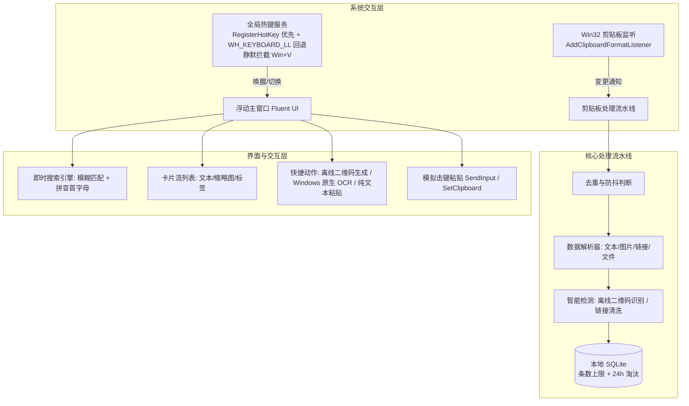

# QuickClip 详细架构与功能设计规范

本文档为 QuickClip Windows 剪贴板工具的详细技术规范与实现设计。

---

## 1. 核心架构设计



---

## 2. 模块技术实现细节

### 2.1 全局热键拦截（替换系统 Win+V）
`HotkeyService` 采用“`RegisterHotKey` 优先、低级钩子回退”的双层策略：

- **可配置热键（默认 `Ctrl+Shift+V` 纯文本粘贴）**：优先调用 `RegisterHotKey` + 隐藏消息窗口（`HwndSource`），由系统可靠投递 `WM_HOTKEY`；组合被其他程序占用导致注册失败时，自动回退到低级钩子检测。
- **`Win + V`（固定，不可修改）**：系统开启剪贴板历史时该组合已被 Shell 注册（`RegisterHotKey` 返回 1409），因此统一由 `WH_KEYBOARD_LL` 钩子接管，采用「Win 键状态机」：
  - **吞掉 Win 键按下**（返回 1），开始菜单根本不会弹出，从根源消除“全屏闪一下”；
  - V 键进入和弦判定：按下/弹起均拦截（返回 1），系统原生剪贴板历史不会弹出，并触发面板切换；
  - **重放保留系统快捷键**：若 Win 之后按下的是其它键（Win+E 等），钩子重放注入「Win + 该键」完整和弦（`SendInput`），系统仍可识别原始快捷键；弹起时再注入 Win 弹起保持键状态平衡；
  - **单独按 Win**：仅在弹起时重放一次 Win 按下/弹起，恢复系统“打开开始菜单”行为。
- 钩子运行在独立后台线程（`GetMessage` 消息泵），回调通过 `Dispatcher.BeginInvoke` 切回 UI 线程；自身 `SendInput` 注入的按键带 `LLKHF_INJECTED` 标志，钩子据此跳过，防止与合成 `Ctrl+V` 互相回环。
- **按键自动重复过滤**：按住 `Win+V` 或纯文本组合时系统会产生连续重复的 `WM_KEYDOWN`，钩子用按下标记（`_winVKeyDown` / `_plainPasteKeyDown`）只响应首次按下，弹起时复位，避免长按导致面板反复切换或连续粘贴。
- **前台置前兜底（解决“呼不出”）**：热键唤起时 Windows 前台锁可能拒绝 `SetForegroundWindow`（面板显示在其他窗口后面或未获得焦点）。`ShowWindow` 采用「临时 `HWND_TOPMOST` 置顶 → `SetForegroundWindow` → 恢复 `HWND_NOTOPMOST`」序列，强制把面板带到最前并激活，规避前台锁限制。
### 2.2 剪贴板监听与防抖
- 使用 `AddClipboardFormatListener(IntPtr hWnd)`。
- 窗口消息循环处理 `WM_CLIPBOARDUPDATE (0x031D)`。
- 粘贴自身回填时置位 `_isSelfPasting = true`，并在捕获事件时过滤，避免循环捕获。

### 2.3 纯离线智能互转引擎
1. **二维码离线解析**：
   - 使用 `ZXing.Net` 库；
   - 捕获图片优先读剪贴板 PNG；WPF `GetImage()` 的 DIB 常带全 0 Alpha，须按不透明写盘，否则缩略图透明且 ZXing 解不出；
   - 捕获到图片后，在后台线程中将其送入 `BarcodeReader.Decode(bitmap)`；
   - 若解析成功，提取 URL/字符串，写入 `qr_content`（卡片 `HasQr` / `QrText`）。
   - 列表同一按钮：文本/链接为「转二维码」；已识别二维码图图标改为解析，悬停仍预览原图，点击把 `QrText` 写成纯文本并抑制捕获。
2. **二维码离线生成**：
   - 使用 `QRCoder` 库；
   - 对任意选中的文本或 URL，在内存中直接调用 `QRCodeGenerator.CreateQrCode(...)` 渲染高清位图，无需网络请求。
3. **Windows 原生离线 OCR**：
   - 引用 WinRT 原生库 `Windows.Media.Ocr.OcrEngine`；
   - 将剪贴板位图转换为 `SoftwareBitmap`，直接本地调用 `engine.RecognizeAsync(softwareBitmap)` 毫秒级提取文本。

### 2.4 存储结构与双限淘汰（条数 + 24h）
- 本地数据库：`quickclip.db`（SQLite）
- 数据表定义：
  ```sql
  CREATE TABLE IF NOT EXISTS clipboard_items (
      id INTEGER PRIMARY KEY AUTOINCREMENT,
      content_type TEXT NOT NULL,          -- 'text', 'image', 'link', 'file'
      text_content TEXT,                   -- 纯文本内容 / 链接 / 文件路径
      preview_path TEXT,                   -- 缩略图路径 (图片类型)
      qr_content TEXT,                     -- 解析出的二维码内容
      char_count INTEGER,                  -- 字符计数或文件大小
      is_pinned INTEGER DEFAULT 0,         -- 0: 正常, 1: 收藏置顶
      created_at DATETIME DEFAULT CURRENT_TIMESTAMP
  );

  CREATE INDEX IF NOT EXISTS idx_created_at ON clipboard_items(created_at);
  ```
- **自动淘汰**（共同作用，置顶豁免）：
  1. **超龄**：非置顶且 `created_at` 早于 24 小时前 → 删除  
  2. **超条数**：总数超过 `MaxHistoryItems`（默认 233，可配置 50～2000）→ 删最旧非置顶  
  写入历史时立即裁条数；定时任务（启动约 8 分钟后，之后每 60 分钟）执行超龄 + 超条数 + 孤儿预览清理。
- **捕获体积（只影响是否记历史，绝不改写系统剪贴板）**：
  - 文本/链接 &gt; 2M 字符 → 不入库  
  - 图片像素 &gt; 40MP 或落盘 PNG &gt; 30MB → 不入库（删临时预览）  
  - 文件：只记路径，不拷贝本体、不进 BLOB；路径列表文本过长则不入库  
  - 超限时用户仍可把内容粘贴到其他程序

---

## 3. UI 界面布局与键盘交互流

### 3.1 界面线框图
```
+-------------------------------------------------------------------------+
|  🔍 搜索剪贴板 (支持拼音首字母/关键词)...           [全部 | 文本 | 图片 | 链接] |
+-------------------------------------------------------------------------+
| [1] 🔗 https://github.com/microsoft/winui3                    [📱转二维码] |
|     Microsoft WinUI 3 官方仓库地址                                 12:40 |
+-------------------------------------------------------------------------+
| [2] 🖼️ [已识别二维码: https://qr.alipay.com/...]              [🔍解析成文] |
|     [缩略图] 商家收银二维码截图                                      11:15 |
+-------------------------------------------------------------------------+
| [3] 🖼️ 软件开发架构图设计稿                                  [🔍提取文字OCR] |
|     [缩略图] 系统架构示意图 (1920x1080)                            09:30 |
+-------------------------------------------------------------------------+
| [4] 📝 public static void SetWindowsHookEx(...)                [💻代码块] |
|     Win32 API 键盘钩子定义                                         昨天   |
+-------------------------------------------------------------------------+
| 💡 状态信息 + [?] 快捷键说明（悬停展示）                                        |
+-------------------------------------------------------------------------+
```

### 3.2 键盘快捷键体系
- `Win + V`：唤起 / 隐藏主面板（全局拦截，替换系统原生剪贴板历史）。
- `Ctrl + Shift + V`：任意程序中以纯文本粘贴（全局可用，去掉原格式）。
- `1 ~ 9`：快速将对应序号项填充并粘贴至目标窗口。
- `↑ / ↓`：在列表中导航移动光标。
- `Enter`：粘贴当前选中项。
- `Shift + Enter`：以纯文本粘贴当前选中项（去掉原格式）。
- `Ctrl + C`：复制当前项到系统剪贴板并自动置顶到列表首位。
- `Ctrl + P`：窗口置顶 / 取消置顶（前端固定，失焦不隐藏）。
- `Delete`：从历史中删除当前项。
- `Esc`：关闭并隐藏窗口。


---

## 4. 实际实现说明（v1.0）

### 4.1 全局热键服务线程模型
- `HotkeyService.Start` 在 UI 线程创建隐藏消息窗口（`HwndSource`），用于接收 `RegisterHotKey` 的 `WM_HOTKEY`；随后启动独立后台线程安装 `WH_KEYBOARD_LL` 钩子并运行标准 Win32 消息泵（`GetMessage` 循环）。
- `RegisterHotKey` 注册结果记录到日志：`Win+V` 在开启剪贴板历史时必然返回 1409，属预期行为，此时由钩子接管；其余热键注册失败时同样回退钩子匹配（按设置中的修饰键 + 主键判断）。
- 卸载时依次 `UnregisterHotKey`、`UnhookWindowsHookEx`、`PostThreadMessage(WM_QUIT)` 退出消息泵，避免线程泄漏。
- 设置变更（`SettingsService.Changed`）会触发 `HotkeyService.ApplyHotkeys` 重新注册，热键即时生效。
### 4.2 SendInput 结构体（x64 易踩坑）
- Win32 `INPUT` 结构体在 x64 下为 **40 字节**（联合体需包含 `MOUSEINPUT / KEYBDINPUT / HARDWAREINPUT` 三成员）。
- 若联合体只声明 `KEYBDINPUT`，结构体只有 32 字节，`SendInput` 会返回 0 且 `GetLastError() == 87 (ERROR_INVALID_PARAMETER)`，模拟击键**静默失败**。
- 项目中的 `NativeMethods.SendCtrlV()`（粘贴回填）已按 40 字节布局实现。

### 4.3 剪贴板监听与防循环
- 使用 `AddClipboardFormatListener` 挂到主窗口句柄，处理 `WM_CLIPBOARDUPDATE (0x031D)`。
- 自身粘贴回填时 `PasteService.IsSelfPasting` 置位 600ms，流水线据此过滤，避免「复制 → 入库 → 回填 → 再捕获」死循环。

### 4.4 诊断日志
- `DebugLog` 默认写入 `%LOCALAPPDATA%\QuickClip\debug.log`（超过 5MB 自动滚动备份），设置 `QUICKCLIP_DEBUG_LOG=1` 可额外记录逐键等详细调试信息。
- 日志覆盖：钩子安装结果 / Win+V 与 Ctrl+Shift+V 拦截 / 窗口切换 / 异常堆栈等关键路径。
- 全局异常兜底：UI 线程异常标记已处理不崩溃，进程级与未观察任务异常记录完整堆栈。

### 4.5 渲染环境自动降级（远程/虚拟显示）
- 问题：在远程控制 / 虚拟显示驱动环境（向日葵 OrayIddDriver、Huawei Virtual Display、Microsoft Remote Display Adapter 等）下，WPF 硬件渲染合成可能黑屏（窗口纯黑，UIA 元素树正常）。
- 检测：`RenderEnvironment.IsRemoteOrVirtualDisplay()` 枚举 `HKLM\SYSTEM\CurrentControlSet\Control\Class\{4d36e968-...}` 显卡驱动描述，匹配 virtual/idd/oray/remote display 等关键字（子键逐个 try-catch，避免无权限子键中断检测）。
- 降级：检测命中时 `RenderOptions.ProcessRenderMode = SoftwareOnly`，背景材质改为 `WindowBackdropType.None` 并使用不透明深色背景（`#1B1B1F`），避免黑屏并保持深色主题可读。
- 正常物理桌面环境不受影响，仍使用 Mica / Acrylic 半透明材质。

### 4.6 设置持久化、自启动与管理员重启
- **设置持久化**：`SettingsService` 将设置写入 `%LOCALAPPDATA%\QuickClip\settings.json`（热键组合、是否启用、开机自启动、窗口置顶），JSON 读取不区分键名大小写，文件损坏时回退默认值。
- **窗口置顶**：主窗口 `Topmost` 与失焦自动隐藏由 `WindowAlwaysOnTop` 设置控制，`Ctrl+P`、标题栏图钉、设置窗口三处入口共享同一来源，变更经 `SettingsService.Changed` 广播即时生效。
- **开机自启动**：`AutoStartService` 读写 `HKCU\Software\Microsoft\Windows\CurrentVersion\Run`（`QuickClip` 值），无需管理员权限；启动时以注册表为准与设置文件对齐。托盘勾选与设置窗口共用同一来源。
- **以管理员身份重启**：`AdminService` 检测当前令牌是否属于 Administrators；非管理员时以 `Verb=runas` 重新启动自身（触发 UAC）并退出当前实例，单实例互斥量带短暂重试，避免新旧实例竞争。

### 4.7 更新机制
- 版本号来自程序集（`csproj <Version>`，打 tag 时由 GitHub Actions 注入）。
- **双渠道**：绿色自包含 `QuickClip.exe`；安装包 `QuickClip-Setup-win-x64.exe`（framework-dependent，需 .NET 8 Desktop Runtime）。安装目录写入 `QuickClip.installed` 以识别渠道。
- **静默检查**：启动约 90 秒后查询 `releases/latest`，之后每 24 小时最多一次。设置 `AutoCheckUpdates` 默认开，关闭后不访问 GitHub。失败只写日志。
- **下载**：按渠道匹配 asset（安装包名含 `Setup`；绿色版优先 `QuickClip.exe`），校验 HTTPS 主机为 GitHub，写入 `%LOCALAPPDATA%\QuickClip\updates\`，不自动覆盖正在运行的进程。
- **安装**：托盘气泡 /「立即更新」菜单 / 设置同一按钮。安装版启动 Setup；绿色版写临时脚本，退出当前进程后自动覆盖 exe 并重启。
