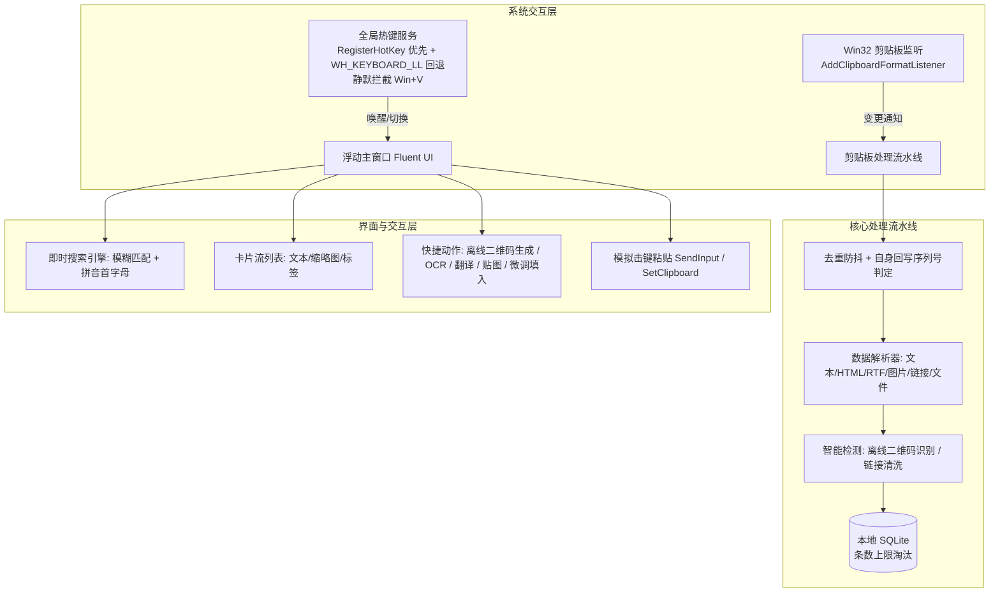

# QuickClip 核心规格、架构设计与需求基线说明书 (SPECIFICATION.md)

> **文档定位**：本文档是 QuickClip 项目的**最高权威规格说明书**，深度融合了**产品需求基线、系统架构设计、Win32 底层实现细节与安全隐私规范**。  
> **适用对象**：项目维护者、协作开发者、以及参与本项目开发与重构的 AI 编程智能体。  
> **核心铁律**：未来任何功能迭代、代码重构、界面优化，**必须严格以此文档为准绳，严禁随意删除、弱化或改坏已有功能与交互体验**。

---

## 目录
1. [产品定位与核心价值观](#一-产品定位与核心价值观)
2. [不可侵犯的系统护栏 (Inviolable Guardrails)](#二-不可侵犯的系统护栏-inviolable-guardrails)
3. [系统功能全景矩阵 (Feature Matrix)](#三-系统功能全景矩阵-feature-matrix)
4. [核心架构与模块技术实现](#四-核心架构与模块技术实现)
   - [4.1 系统整体架构图](#41-系统整体架构图)
   - [4.2 剪贴板监听、防抖与 Win32 原生调用](#42-剪贴板监听防抖与-win32-原生调用)
   - [4.3 全局热键拦截与状态机 (Win+V 接管)](#43-全局热键拦截与状态机-winv-接管)
   - [4.4 粘贴注入、前台锁与目标窗口交互体系](#44-粘贴注入前台锁与目标窗口交互体系)
   - [4.5 连续粘贴栈模式 (收集栈)](#45-连续粘贴栈模式-收集栈)
   - [4.6 常用短语库与动态模板引擎](#46-常用短语库与动态模板引擎)
   - [4.7 桌面贴图置顶系统](#47-桌面贴图置顶系统)
   - [4.8 离线与智能互转引擎 (二维码 / OCR / 翻译)](#48-离线与智能互转引擎-二维码--ocr--翻译)
   - [4.9 本地存储、条数轮转淘汰与损坏自愈](#49-本地存储条数轮转淘汰与损坏自愈)
5. [系统兼容性、渲染降级与运行环境](#五-系统兼容性渲染降级与运行环境)
6. [安全、隐私与敏感数据规约](#六-安全隐私与敏感数据规约)
7. [界面文案与交互体验规范](#七-界面文案与交互体验规范)
8. [开发避坑指南与反模式 (Anti-Patterns)](#八-开发避坑指南与反模式-anti-patterns)

---

## 一、 产品定位与核心价值观

### 1.1 产品定义
QuickClip 是一款专为 Windows 平台打造的**极速、纯粹、高可靠的本地剪贴板生产力工具**。基于 .NET 8 与 WPF 构建，原生静默接管 `Win + V`，零云端上传，极致隐私，毫秒响应。

### 1.2 核心理念
1. **纯本地离线，绝不触碰云端**：
   - 剪贴板属于最高级别的个人与企业隐私通道（包含账号、密码、密钥、身份证、通讯录、商业机密等）。
   - QuickClip 坚决不设账号系统，不向任何云端上传用户剪贴数据，数据 100% 持久化在用户本地 SQLite。
   - **关于多端同步的解耦美学**：成熟输入法（如微信输入法、搜狗输入法）与操作系统互联已将跨端传输做到极致，其跨端同步最终通过 Win32 API 写入本机剪贴板。QuickClip 专注于通过底层事件捕获本机剪贴板，无需重复造轮子，既实现多端打通，又守住本地隐私底线。
2. **极速响应，无感打扰**：
   - 启动、唤起、检索、粘贴必须在毫秒内完成。开机自启通过后台静默预热，杜绝首次冷卡顿。
3. **忠实还原，绝不篡改**：
   - 剪贴板管理器的神圣天职是**“忠实记录、原样还原”**。严禁自作聪明地做任何文本“猜测与自动矫正”，绝不破坏用户的代码、多语言字符或特殊格式。

---

## 二、 不可侵犯的系统护栏 (Inviolable Guardrails)

在后续的任何代码改动中，必须恪守以下**六大红线**：

1. 🔴 **严禁破坏既有功能**：
   - 新增功能或优化性能时，必须保证全量现有功能不受影响。若遇冲突，应设计优雅的协同机制，绝不能通过“砍掉旧功能”来逃避技术难点。
2. 🔴 **严禁篡改剪贴板原始数据**：
   - 复制的数据必须原汁原味入库并原汁原味粘贴。严禁加入任何未经用户明确授权的“智能转码 / 乱码猜测修复”，防止破坏正常 Base64、多语言符号或二进制文本。
3. 🔴 **严禁污染系统剪贴板**：
   - 捕获阶段只读系统剪贴板（`Capture` 只读不写）。只有当用户主动触发“粘贴”或“复制”时才允许覆盖系统剪贴板。
   - 用户主动暂停捕获或复制敏感内容时，不得有任何隐式写盘行为。
4. 🔴 **严禁违背 Windows 线程与焦点模型**：
   - 所有窗口激活、焦点转交、UI 动画必须严格在 UI 主线程执行；所有剪贴板 I/O、图片编码、网络调用、数据库读写必须在后台 STA 线程或线程池执行，互不阻塞。
5. 🔴 **文案克制与交互减负**：
   - 界面文案必须精炼专业，严禁堆砌技术实现细节（如“免密直连”、“延迟毫秒”等冗余词）。
6. 🔴 **严格遵循安全与发版规范**：
   - 保持双渠道发版同步（GitHub + 国内 Gitee 镜像优先）；严格遵循 Windows 环境安全准则。

---

## 三、 系统功能全景矩阵 (Feature Matrix)

| 模块 | 核心功能 | 触发方式 / 入口 | 解决的核心用户痛点 |
| :--- | :--- | :--- | :--- |
| **系统接管** | Win+V 接管 | 键盘 `Win + V` | 替代 Windows 原生剪贴板的卡顿、漏记与无序 |
| **系统接管** | 原始状态快照与自愈 | 启动/退出/设置开关 | 退出或卸载时 100% 还原系统注册表与自带剪贴板 |
| **系统接管** | 开机静默预热 | 开机自启后台触发 | 彻底根除开机后首次按 Win+V 需等待 2~3 秒冷启动卡顿 |
| **剪贴历史** | 文本/链接/图片/文件分流 | 复制操作自动触发 | 多类型内容混合呈现，文件多选保留全路径与元数据 |
| **剪贴历史** | 格式保留 (HTML/RTF) | 普通粘贴自动回写 | 网页、Word 等富文本粘贴回编辑器时不丢失排版与颜色 |
| **剪贴历史** | 拼音首字母模糊检索 | 搜索框输入拼音首字母 | 输入 `sjjg` 瞬间匹配 `设计架构`，海量数据秒查 |
| **剪贴历史** | 图钉条目置顶 | 卡片图钉 / 快捷键 | 高频关键数据常驻顶部，不受历史淘汰轮转影响 |
| **粘贴交互** | 双击 / Enter 粘贴 | 双击列表 / 按 Enter | 快速将选中内容注入到外部编辑软件（如 Notepad++） |
| **粘贴交互** | 强制纯文本粘贴 | `Shift + Enter` | 剥离富文本样式，安全粘贴至纯文本终端或代码编辑器 |
| **粘贴交互** | 1~9 数字键极速粘贴 | 键盘按下 `1` ~ `9` | 无需移动光标，一键将前 9 项秒速贴入目标程序 |
| **粘贴交互** | 连续粘贴模式 | 设置开启 / 键盘方向键 | 按 Enter 粘贴后保持面板激活，无需重复按 Win+V |
| **收集栈** | 顺序收集与出栈 (FIFO) | `Ctrl + Shift + S` 全局开关 | 跨应用多字段批量迁移数据，按复制顺序依次粘贴 |
| **收集栈** | 文本行拆分压栈 | 悬浮 HUD / 右键菜单 | 将多行清单或表格按行打散，依次单行粘贴 |
| **常用短语** | 分类常用文本库 | 顶部「常用短语」分栏 | 固化回复模版、常用配置、常用代码片段 |
| **常用短语** | 动态占位符自动解析 | 粘贴时动态运算注入 | 自动填入当前日期、时间、UUID、用户设备名等 |
| **常用短语** | 短语微调填入 | 卡片微调按钮 / 右键菜单 | 粘贴前临时增补修改参数，无需破坏或新建原始模版 |
| **桌面贴图** | 图片/截图桌面钉住 | 卡片贴图按钮 / 右键菜单 | 类似 Snipaste，将参考图置顶浮在屏幕供对照 |
| **桌面贴图** | 滚轮缩放与透明度 | 鼠标滚轮 / Ctrl+滚轮 | 20%~400% 无级缩放，透明度自由调节不遮挡底层代码 |
| **二维码** | 文本/链接一键生成二维码 | 卡片二维码图标悬停 | 电脑文字一秒传给手机，手机扫码即得 |
| **二维码** | 图片二维码自动识别提取 | 复制含码图片自动解析 | 截图里的二维码无需掏出手机，电脑直接复制/直贴文本 |
| **OCR 识别** | 本地离线 / 视觉大模型双模 | 卡片 OCR 按钮 | 图片转文字，结果支持原位在线纠错后再复制/粘贴 |
| **文本翻译** | 卡片抽屉式双向互译 | 卡片翻译按钮 / 右键菜单 | 中英及多语种双向翻译，直接替换粘贴至目标窗口 |

---

## 四、 核心架构与模块技术实现

### 4.1 系统整体架构图

### 4.2 剪贴板监听、防抖与 Win32 原生调用
- **弃用 OLE，改用 Win32 原生 API**：
  - 弃用 WPF/OLE Clipboard API，防止属主进程卡死时拖死 QuickClip。使用 `OpenClipboard`、`GetClipboardData`、`SetClipboardData`，打开失败带毫秒级短重试与占用进程日志诊断。
  - 支持 `CF_UNICODETEXT`、`CF_TEXT`、`CF_HDROP`（文件列表）、`CF_DIB` / `CF_DIBV5`（高保真位图）以及自定义注册格式 `PNG`、`HTML Format`、`Rich Text Format`。
- **自身回写精准过滤（剪贴板序列号）**：
  - `PasteService` 写入成功后记录 `GetClipboardSequenceNumber()`，流水线捕获时比对序列号，相同则判定为自身写入并丢弃。彻底废除粗暴的 2.5 秒时间盲窗，用户在粘贴后立即进行的外部复制 100% 保留。
- **监听生命周期**：
  - 通过 `AddClipboardFormatListener` 挂接到主窗口句柄；开机自启动时提前调用 `WindowInteropHelper.EnsureHandle()` 创建句柄，确保无需弹出窗口也能正常监听。

### 4.3 全局热键拦截与状态机 (Win+V 接管)
- **双层拦截架构**：
  - `RegisterHotKey` 优先：普通自定义快捷键由隐藏消息窗口（`HwndSource`）接收 `WM_HOTKEY`。
  - `WH_KEYBOARD_LL` 低级钩子回退：`Win + V` 在系统开启自带剪贴板时已被 Shell 占用（返回 1409），统一由底层键盘钩子接管。
- **Win 键状态机逻辑**：
  1. 吞掉 Win 键按下（返回 1），阻止开始菜单弹出，根除“全屏闪烁”；
  2. V 键和弦判定：拦截 V 键按下/弹起，触发 QuickClip 面板切换；
  3. 重放机制：若 Win 之后按的是其他键（如 Win+E），钩子通过 `SendInput` 注入完整和弦，确保系统自带快捷键不受影响；
  4. 单独按 Win 弹起时重放一次 Win 击键，恢复系统打开开始菜单的正常交互。
- **管理员窗口穿透兜底 (UIPI)**：
  - Windows UIPI 权限隔离导致普通权限钩子收不到管理员窗口的按键。`SystemClipboardGuard` 以低频轮询前台，一旦检测到系统原生剪贴板历史窗口弹出，立即注入 ESC 关闭并唤起 QuickClip，实现全窗口无死角接管。
- **系统状态快照与退出自愈**：
  - 接管前把注册表（`EnableClipboardHistory`、`DisabledHotkeys`）快照保存至 `system-clipboard-snapshot.json`；退出、关闭接管或卸载时 100% 原样还原。

### 4.4 粘贴注入、前台锁与目标窗口交互体系
- **前台焦点转交铁律**：
  - 在置顶模式或连续粘贴模式下，UI 线程（Thread 1）必须在派发粘贴前主动调用 `SetForegroundWindow(target)`，由当前前台属主线程主动转交焦点，Windows 前台锁无条件放行。严禁在后台线程池中强行夺取前台。
- **目标窗口追踪机制**：
  - 必须精准锁定用户正在编辑的真实外部程序（如 Notepad++、VSCode、微信、浏览器），严格过滤桌面（Progman/WorkerW）、任务栏（Shell_TrayWnd）以及 QuickClip 自身所有子窗口。
- **SendInput 结构体规范 (x64)**：
  - Win32 `INPUT` 结构体在 x64 下必须为 **40 字节**（联合体包含 MOUSEINPUT/KEYBDINPUT/HARDWAREINPUT），严禁简写为 32 字节，否则 `SendInput` 会报错误码 87 静默失败。

### 4.5 连续粘贴栈模式 (收集栈)
- **先进先出 (FIFO) 队列**：针对多字段批量迁移场景，开启后外部连续复制的内容顺序压入栈底。
- **显式开关与桌面 HUD**：通过全局快捷键（默认 `Ctrl + Shift + S`）切换，桌面悬浮迷你 HUD 实时呈现剩余项数与下一项预览。
- **物理 Ctrl+V 出栈**：底层钩子拦截目标窗口内的 `Ctrl + V`，逐项出栈注入，全部粘贴完毕后自动退出栈模式。

### 4.6 常用短语库与动态模板引擎
- **独立分类收纳**：独立 Tab 呈现，支持通用、代码、办公等分类管理。
- **动态占位符引擎**：
  - 日期时间：`{date}`、`{time}`、`{datetime}`、`{year}`、`{month}`、`{day}`、`{weekday}`、`{week}`
  - 时间戳：`{timestamp}`（10位）、`{timestamp_ms}`（13位）
  - 唯一标识：`{guid}` / `{uuid}`、`{guid_n}`
  - 设备用户：`{username}` / `{user}`、`{computername}` / `{device}`
  - 随机与剪贴板：`{random4}`、`{random6}`、`{clipboard}`
- **微调填入 (Snippet Quick Adjust)**：
  - 粘贴前弹出轻量微调窗，就地微调参数，按 `Ctrl + Enter` 一键替换并注入目标窗口，不破坏原始模版。

### 4.7 桌面贴图置顶系统
- **便签式置顶**：图片、截图一键钉在屏幕最前端，按住任意区域平滑拖拽。
- **无级交互**：鼠标滚轮实现 20%~400% 缩放；Ctrl+滚轮实现 20%~100% 透明度渐变。
- **快捷退出**：双击图片或按 `Esc` 瞬时关闭。

### 4.8 离线与智能互转引擎 (二维码 / OCR / 翻译)
- **二维码双向互通**：文本一键生成高清二维码供手机扫码；复制含码图片后台自动解析提取，支持双击色块直贴。
- **OCR 双模与在线纠错**：支持系统 WinRT 离线 OCR 与 OpenAI 兼容视觉大模型；识别弹窗支持直接编辑改错，修改后防误关二次确认。
- **抽屉式智能翻译**：卡片向下平滑展开译文，中英双向互译，支持大模型优先与微软/Google 免密通道降级。

### 4.9 本地存储、条数轮转淘汰与损坏自愈
- **数据库规范**：本地 SQLite（`quickclip.db`），建表存储 `content_type`、`text_content`、`html_content`、`rtf_content`、`preview_path`、`qr_content`、`char_count`、`is_pinned`。
- **轮转淘汰**：超出上限（默认 233 条）淘汰最旧非置顶条目，置顶项（`is_pinned = 1`）受保护不淘汰。删除条目联动删除本地图片缩略图。
- **损坏自愈**：检测到 SQLite 损坏时改名备份为 `.corrupt-<时间戳>` 并重建空库，避免进程启动崩溃。

---

## 五、 系统兼容性、渲染降级与运行环境

### 5.1 系统支持矩阵

| 操作系统 | 支持情况 | 材质表现 |
| :--- | :---: | :--- |
| **Windows 11** | ✅ 完整支持（推荐） | Mica 材质 |
| **Windows 10 1809+**（含 19041+） | ✅ 完整支持 | Acrylic 材质 |
| Windows 10 早期版本（< 1809） | ❌ 不支持 | 缺少必要 WinRT 与 XAML 依赖 |
| Windows 7 / 8 / 8.1 | ❌ **不支持** | .NET 8 与系统 SDK 硬性限制，不做兼容 |

### 5.2 渲染环境自动降级 (RDP / 虚拟显示)
- **痛点**：向日葵（OrayIddDriver）、华为虚拟显卡、Windows 远程桌面（RDP）下硬件渲染合成易导致全黑屏。
- **策略**：检测驱动描述命中 virtual / idd / oray / remote display 时，自动切换为 `RenderOptions.ProcessRenderMode = SoftwareOnly`，材质降级为深色不透明背景，彻底杜绝黑屏与闪烁。

---

## 六、 安全、隐私与敏感数据规约

1. **数据完全归属本机**：
   - 存储路径固定为 `%LOCALAPPDATA%\QuickClip\`，严禁写入项目仓库。
   - 包含：`quickclip.db`、`previews/`、`settings.json`、`updates/`、`ocr/`、`debug.log`。
2. **严禁泄露敏感信息**：
   - 剪贴板正文、用户密码、图片数据**严禁写入 `debug.log`**。
   - 视觉接口 API Key 仅存本地 `settings.json`，设置页采用 PasswordBox，禁止明文日志输出。
   - 诊断日志记录 URL 时必须剔除 query 参数（防止泄露 CDN 鉴权 key）。
3. **日志防膨胀硬上限**：
   - 单文件 2MB 滚动（`.1`、`.2`），合计约 6MB，硬上限 8MB 停止写入，杜绝挤占用户磁盘。

---

## 七、 界面文案与交互体验规范

1. **文案精炼克制**：
   - 按钮与操作统一简明直观：使用「粘贴」而非「应用并粘贴」；使用「保存」而非「保存修改」；使用「复制」而非「仅复制」；使用「贴图置顶」而非「贴图到桌面前端」。
   - 下拉选项不得堆砌实现词：统一为「微软翻译」、「Google 翻译」、「AI 模型翻译」，严禁使用「免密/直连」等词汇。
2. **交互防误触与无缝连贯**：
   - 鼠标双击粘贴必须排空按键消息，严禁让 `WM_LBUTTONUP` 穿透到底层网页或软件链接上造成误点。
   - 连续粘贴模式下，粘贴完成不得强制下移选中项，交由用户自主决定。

---

## 八、 开发避坑指南与反模式 (Anti-Patterns)

1. ❌ **反模式 1：在后台线程调用 `SetForegroundWindow`**
   - **后果**：Windows 前台锁坚决拦截，外部程序无法激活，后续 Ctrl+V 丢失。
   - **正确做法**：转交前台焦点必须在 UI 主线程执行。
2. ❌ **反模式 2：依赖不可靠的 `WM_ACTIVATE` 寻找外部窗口**
   - **后果**：置顶模式下 `lParam` 经常为 0，顺着 Z 序盲查易将桌面（`explorer.exe`）误当目标。
   - **正确做法**：采用全局前台监听或稳固的外部窗口追踪。
3. ❌ **反模式 3：对剪贴板数据做主观猜测与转码矫正**
   - **后果**：误伤正常数据，造成不可逆破坏。
   - **正确做法**：原汁原味入库、原汁原味提取。
4. ❌ **反模式 4：为了修一个模式改坏另一个模式**
   - **后果**：修置顶模式搞坏普通模式，或修连续粘贴搞坏单次粘贴。
   - **正确做法**：每次修改必须在**普通模式（唤起即粘、粘后即藏）**与**置顶模式（常驻便签、连续交互）**两种场景下分别回归验证。

---
*本规范为 QuickClip 项目研发与维护的永久基线文档。*
